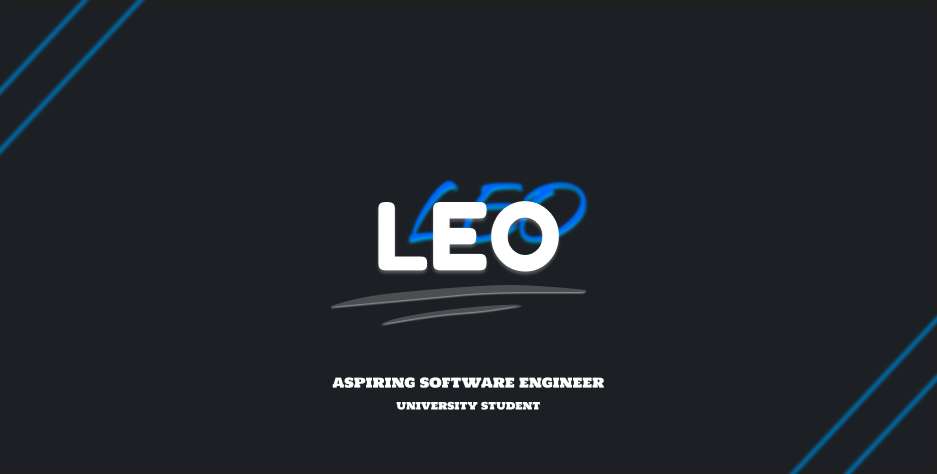

 

  <h1>
    
  </h1>

## 👋 About Me:
- 🖥️ **Computer Enthusiast**
- 👨‍💻 **Aspiring Developer**
- 🧑‍🎓 **Currently Studying Software Engineering In University**
- 📖 **Learning New Technologies To Better Improve Skills**

## 💻 Currently Learning:
### **Languages:**
      

### **Tools:**
  

### **Wanting To Learn:**
      

## 🏆 GitHub Trophies

<picture>
  <source media="(prefers-color-scheme: dark)" srcset="https://raw.githubusercontent.com/Leoelo4/Leoelo4/output/github-snake-dark.svg" />
  <source media="(prefers-color-scheme: light)" srcset="https://raw.githubusercontent.com/Leoelo4/Leoelo4/output/github-snake.svg" />
  
</picture>

## 🌐 Socials:
### Reach out to me using:

